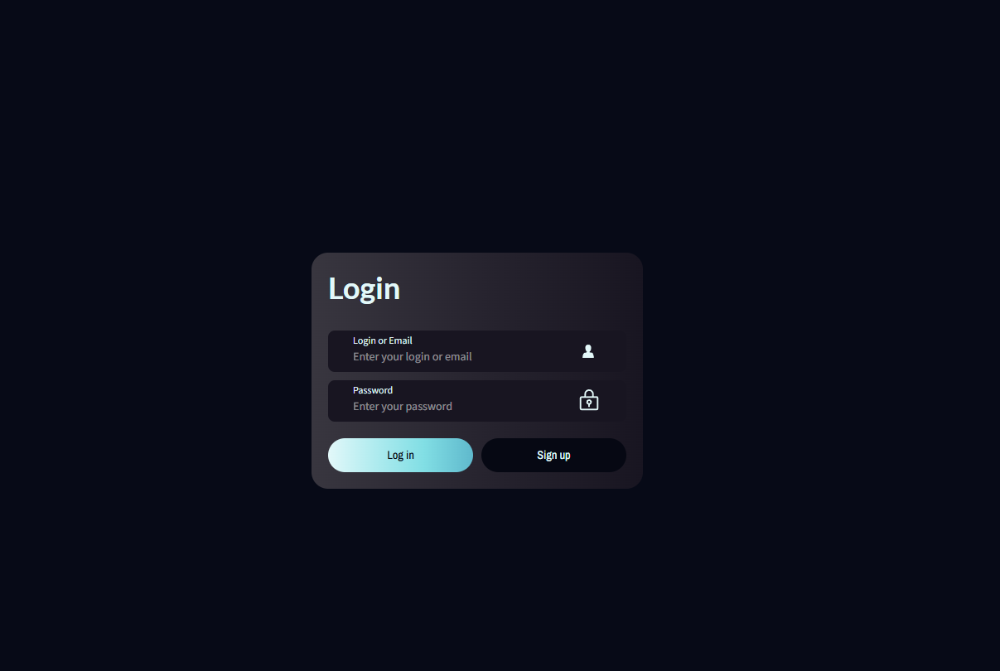
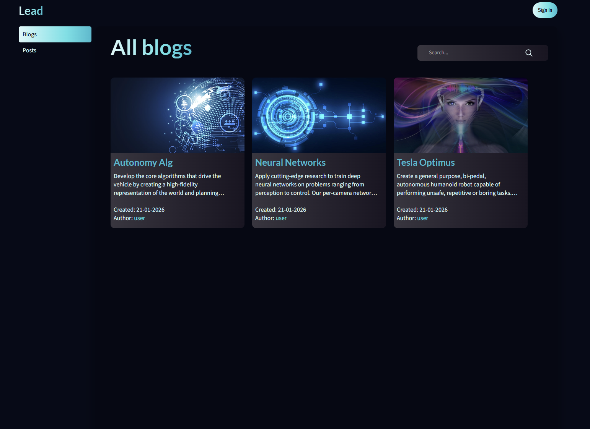
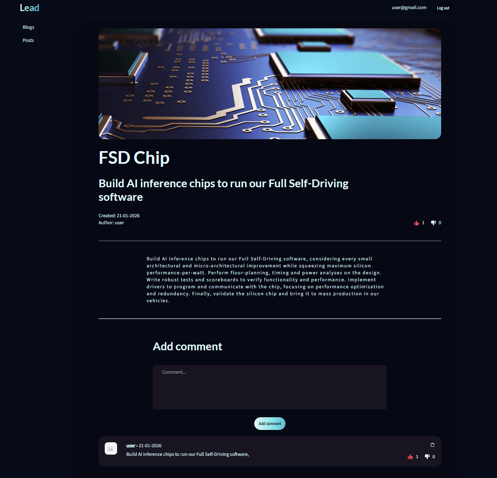

# Blog Platform — Full-Stack (React + NestJS)

A full-stack blog platform with authentication, blogs & posts management, comments, and like/dislike reactions.  
The project focuses on **production-grade client state management** (TanStack Query, optimistic updates, cache consistency) and a **clean API architecture** on the backend (NestJS + MongoDB/Mongoose).

## Live Demo

[Open Live Demo](https://lead-blog-brh3.vercel.app/)

## Screenshots





---

## Tech Stack

### Frontend

- **React** + **TypeScript**
- **React Router** (nested routes, protected routes)
- **TanStack Query (React Query)**
    - Infinite lists (pagination)
    - Optimistic updates (likes/dislikes)
    - Cache synchronization and rollback on error
- **SCSS Modules** (component-scoped styles)
- **FormData uploads** (image upload)

### Backend

[You can find backend here](https://github.com/Dmytro-Doronin/blog-backend-Nest)

- **NestJS**
- **MongoDB** + **Mongoose**
- **JWT Authentication** (protected endpoints via guards)
- **Validation** via `class-validator` (plus trimming)
- **Likes/Dislikes** domain for Posts and Comments

### Infrastructure / Storage

- **AWS S3** (media storage for images)
- **Cookie-based token storage** on client (accessToken)

---

## Features

### Authentication

- Register / Login / Logout
- “Me” endpoint for restoring session
- Protected routes for create/edit actions

### Blogs

- List blogs with pagination
- Create blog (authenticated)
- Edit/Delete blog (owner-only)

### Posts

- Global posts feed (pagination + sorting)
- Blog-specific posts feed (via `/blogs/:id/posts`)
- Create post inside a specific blog (authenticated)
- Edit/Delete post (owner-only)
- Optional image upload (S3)

### Comments (Post details)

- Add comment
- Delete comment (owner-only)
- Pagination + sorting
- Like / Dislike / None toggle for each comment

### Reactions (Likes/Dislikes)

- Posts and comments support:
    - Like / Dislike / None (toggle)
    - Counts for likes/dislikes
    - Personal status (`myStatus`) based on authorized user
- Optimistic UI updates on client with rollback on error
- Server returns updated entity to keep client cache consistent

### UX / UI

- Skeleton loading for page-level loads
- Smooth navigation (card click → details)
- Prevent event bubbling (like buttons do not trigger card navigation)
- Active navigation highlighting

---

## Project Structure (High-level)

### Frontend (example)

- `api/` — HTTP clients + endpoints
- `hooks/` — query/mutation hooks (TanStack Query)
- `components/` — UI components (Cards, Header, LikeDislike, CommentSection)
- `helpers/` — mappers, cache helpers (optimistic updates)
- `pages/` — route pages (BlogsPage, PostsPage, EditPostPage, etc.)

### Backend (example)

- Feature modules:
    - `posts/`, `blogs/`, `comments/`, `likes/`, `auth/`
- `repositories/` — query + command repos (Mongo/Mongoose)
- `services/` — business logic + output model mapping

---

## API Overview (Example)

### Posts

- `GET /posts` — list all posts (pagination, sorting)
- `GET /blogs/:id/posts` — posts for a specific blog
- `PUT /posts/:id/like-status` — set like status (`Like` / `Dislike` / `None`)

### Comments

- `GET /posts/:id/comments` — list comments for a post (pagination, sorting)
- `POST /posts/:id/comments` — add comment
- `PUT /comments/:id` — edit comment
- `DELETE /comments/:id` — delete comment
- `PUT /comments/:id/like-status` — set like status (`Like` / `Dislike` / `None`)

> Note: protected endpoints can return user-specific fields like `myStatus` based on JWT.

---

## Getting Started

### Clone repository

```bash
git clone git@github.com:Dmytro-Doronin/Lead-blog.git

npm install
npm run dev
```
